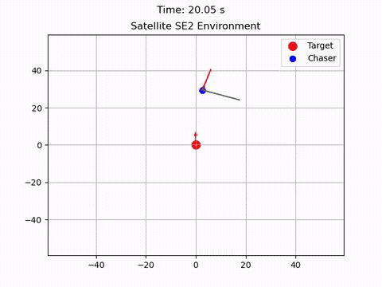
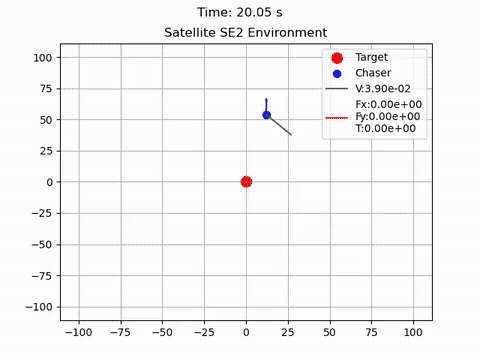

# SafeGym

Implementation of satellite environments and other environments to explore SafeRL


# SafeGym

SafeGym is a Gymnasium environment coupled with tools aimed at facilitating Safe Reinforcement Learning (SafeRL) research and development.
<table>
      <td>
      <td>
</table>


## Features

- **Customizable Environment**: Create a variety of satellite chasing scenarios with customizable starting states and noise.
- **Underactuated and Fully Actuated Dynamics**: Simulate real-world control dynamics with options for both underactuated and fully actuated control systems.
- **Reward Shaping**: Built-in reward shaping functionality to guide the learning process towards safe and effective solutions.
- **Truncation and Termination**: Control the episode flow with truncation and termination conditions to manage the agent's learning experience.
- **Visualization Tools**: Render the environment and visualize the agent's interactions and performance over time.
- **Testing Utilities**: Validate the environment and control algorithms with a set of provided testing functions.


## Getting Started

Clone the repository to your local machine:

```bash
git clone https://github.com/spbisc97/SafeGym.git
cd SafeGym
```

Ensure you have the necessary dependencies installed. The primary dependencies include:

- gymnasium
- numpy
- matplotlib


## Usage

### Install
```bash
pip install -e .
```
### Run a simple experiment

```python
import safegym
import gymnasium as gym

env = gym.make('Satellite-SE',render_mode="human")
observation,info = env.reset()
DONE=False

while not DONE
    action = env.action_space.sample()
    observation, reward, term, trunc, info = env.step(action)
    DONE = term or trunc

env.close()
```


