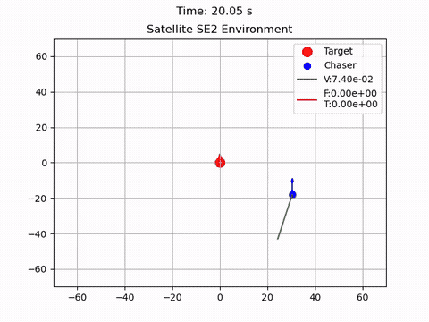

# SafeGym

Implementation of satellite environments and other environments to explore SafeRL


# SafeGym

SafeGym is a Gymnasium environment coupled with tools aimed at facilitating Safe Reinforcement Learning (SafeRL) research and development.
<table>
      <td>
      <td>
</table>


## Features

- **Customizable Environment**: Create a variety of satellite chasing scenarios with customizable starting states and noise.
- **Underactuated and Fully Actuated Dynamics**: Simulate real-world control dynamics with options for both underactuated and fully actuated control systems.
- **Reward Shaping**: Built-in reward shaping functionality to guide the learning process towards safe and effective solutions.
- **Truncation and Termination**: Control the episode flow with truncation and termination conditions to manage the agent's learning experience.
- **Visualization Tools**: Render the environment and visualize the agent's interactions and performance over time.
- **Testing Utilities**: Validate the environment and control algorithms with a set of provided testing functions.


## Getting Started

Ensure you have the necessary dependencies installed in your env. The primary dependencies include:

- gymnasium
- numpy
- matplotlib

### Install
Using git:
```bash
git clone https://github.com/spbisc97/SafeGym.git
cd SafeGym
pip install -e .
```
or using pip (PyPI)
```
pip install safegym
```

Extras
- Baseline (core deps only): `pip install -e .`
- Mujoco env: `pip install -e .[mujoco]`
- Stable-Baselines3 examples: `pip install -e .[sb3]`
- Snake/pygame env: `pip install -e .[pygame]`
- Everything: `pip install -e .[all]`

Notes
- MoviePy: The project requires moviepy>=2. If an older version is detected during installation, setup will raise a clear error. Upgrade via `pip install -U moviepy`.
- Numba: Included by default for performance. If unavailable, code falls back to pure Python and will run slower.
### Run a simple experiment

```python
import safegym
from safegym.envs import *
import gymnasium as gym

env = gym.make('Satellite-SE',render_mode="human")
observation,info = env.reset()
DONE=False

while not DONE
    action = env.action_space.sample()
    observation, reward, term, trunc, info = env.step(action)
    DONE = term or trunc

env.close()
```

### Documentation
TBD


